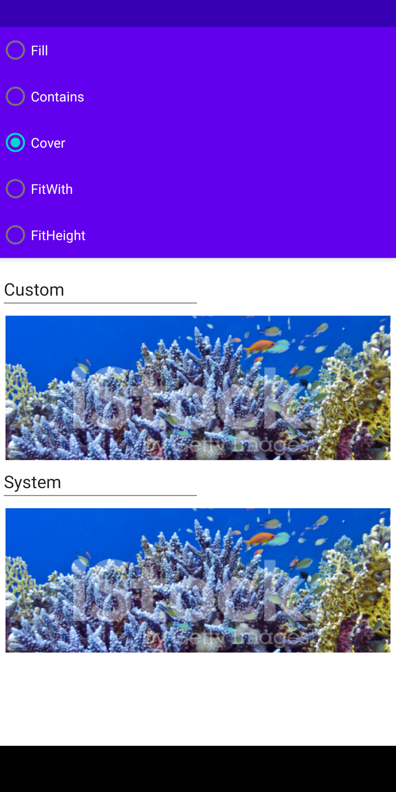
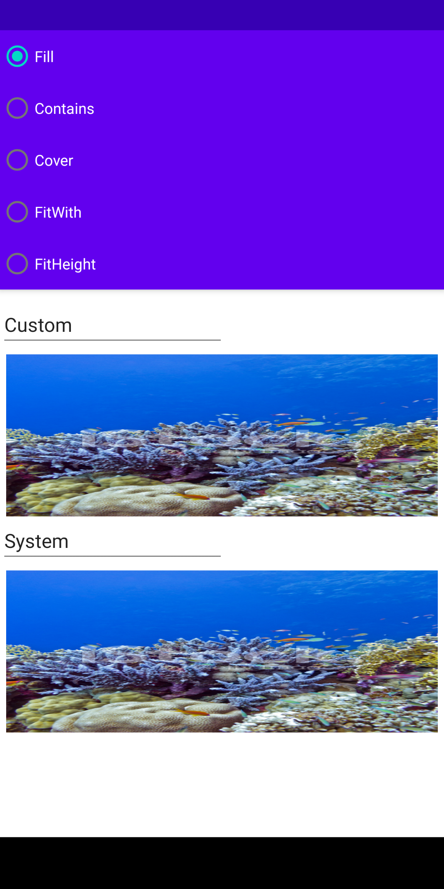
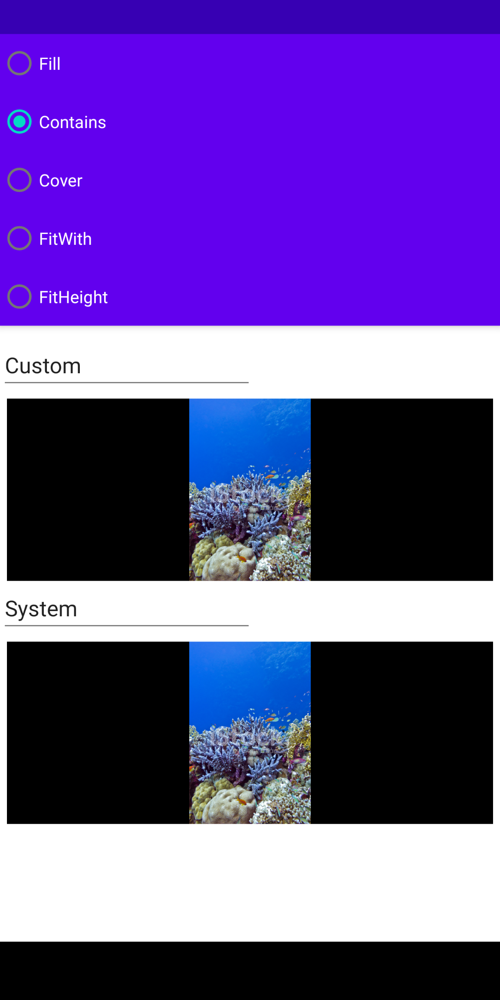

通过Bitmap构造函数参数调整来实现和Flutter BoxFit枚举对应的压缩效果

例图上半部分通过bitmap API实现，下半部分通过调整ImageView的scaleType实现

具体参考BitmapBoxFit.kt内容

 

<table>
<tr>
<td>

cover

</td>
<td>

fill

</td>
<td>

contains

</td>
</tr>
</table>

示例代码：

	 bitmap.boxFitFill(width, height)
	 bitmap.boxFitCover(width, height)
	 bitmap.boxFitFitHeight(height)

